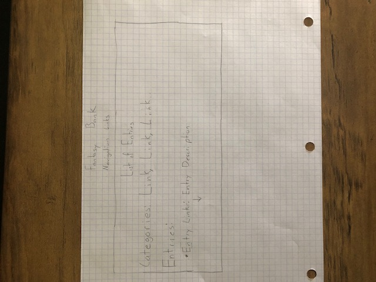
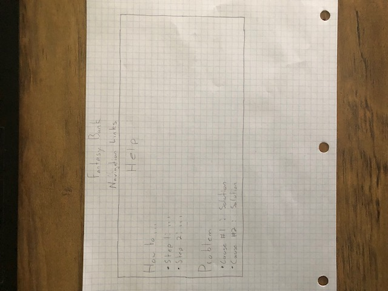

# Project Design
I'd like to increase the usability of my site. I'll do this by focusing on Inclusive Design and the tenth Usability Heuristic.

## Inclusive Design
Overall, I plan to make my site look better.  To acomplish this, I'll add a small font size increase for the paragraph tags to increase readability.  I'll also change the colors a little so reading the page content becomes easier.  In addition, I will try to make links more obvious by making them larger and adding a :hover style to them.

## Usability Heuristic #10: Help and Documentation

I expect that users will be able to operate the site without help.  In case a user does have a problem operating the site, I'll create a "Help" page.  This page will be used to aid the users in the operation of my site.  The page will include instructions on how to add an entry to the database, how to find a specific entry, and other potential problems.  I'll also add a link to my email so users can contact me if the "Help" page doesn't list their issue.

